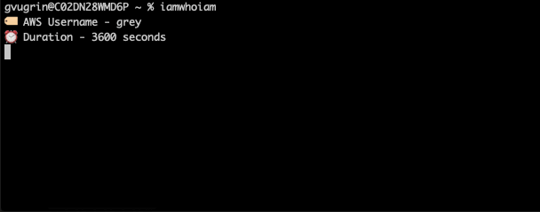

# Intro


SSH into AWS EC2 instances securely via SSM using MFA + AWS temporary credentials.
- ✅ No hardcoded IP addresses
- ✅ No shared PEM files. Uses temporary SSH keys
- ✅ Access controlled in AWS

# Requirements

## Packages
- OpenSSH > 7.3p1. Check with `ssh -V`
- [AWS CLI v2 installed](https://docs.aws.amazon.com/cli/latest/userguide/getting-started-install.html)
- [AWS CLI configured](https://docs.aws.amazon.com/cli/latest/userguide/cli-configure-quickstart.html#cli-configure-quickstart-config)
- [SSM AWS CLI plugin](https://docs.aws.amazon.com/systems-manager/latest/userguide/session-manager-working-with-install-plugin.html#install-plugin-macos-signed) installed
- `pip` installed.
  ```
  curl https://bootstrap.pypa.io/get-pip.py -o get-pip.py
  python3 get-pip.py
  ```
- AWS MFA pip package installed.
  - Use `pip install aws-mfa` (try pip3 if pip is not found post install)

## AWS

### User Setup
- Each user must have a MFA device assigned. [AWS documentation](https://docs.aws.amazon.com/IAM/latest/UserGuide/id_credentials_mfa_enable_virtual.html)
- Each user must have a policy like this (via their group ideally).

  Remember to replace the YOUR_ACCOUNT_ID with your own.
  If you want to restrict the instances that can be accessed, you can replace the `*` in the `Resource` array with the instance ID, and copy the entry for each instance you want to allow access to.

  <details>
    <summary>Policy</summary>

    ```
    {
        "Version": "2012-10-17",
        "Statement": [
            {
                "Sid": "VisualEditor0",
                "Effect": "Allow",
                "Action": [
                    "ec2:DescribeInstances",
                    "ssm:GetConnectionStatus",
                    "ssm:DescribeSessions",
                    "ssm:DescribeInstanceProperties",
                    "ssm:GetCommandInvocation",
                    "ssm:ListCommands",
                    "ssm:ListCommandInvocations"
                ],
                "Resource": "*"
            },
            {
                "Sid": "VisualEditor1",
                "Effect": "Allow",
                "Action": [
                    "ssm:SendCommand",
                    "ssm:StartSession"
                ],
                "Resource": [
                    "arn:aws:ec2:*:YOUR_ACCOUNT_ID:instance/*",
                    "arn:aws:ssm:*::document/SSM-SessionManagerRunShell",
                    "arn:aws:ssm:*::document/AWS-StartSSHSession",
                    "arn:aws:ssm:*::document/AWS-RunShellScript",
                    "arn:aws:ssm:*::document/AWS-StartInteractiveCommand"
                ]
            },
            {
                "Sid": "VisualEditor4",
                "Effect": "Allow",
                "Action": [
                    "ssm:ResumeSession",
                    "ssm:TerminateSession"
                ],
                "Resource": "arn:aws:ssm:*:*:session/${aws:username}-*"
            }
        ]
    }
    ```
  </details>

### Instance Setup
- Each instance must have an IAM role assigned to it. [AWS documentation](https://docs.aws.amazon.com/AWSEC2/latest/UserGuide/iam-roles-for-amazon-ec2.html#attach-iam-role)
- Each instance must have a policy attached to its role that enables SSM (`AmazonSSMManagedInstanceCore` is the AWS-managed policy that does this) [AWS documentation](https://docs.aws.amazon.com/systems-manager/latest/userguide/session-manager-getting-started-instance-profile.html)
- The role must be tagged with the correct user for SSM to run (ex: `ubuntu` for Ubuntu AMIs).
Ex: Tag Name: `SSMSessionRunAs` Tag Value:	`ubuntu`
- The SSM agent must be running (AWS Linux & Ubuntu instances have this by default)
- If this step is taken care of, you will see the instance in the SSM Overview panel in AWS (Node Management > Fleet Manager)

# Installation
Get the location of this folder with `pwd`. Copy and replace it in the commands below where you see *_FOLDER_LOCATION_*.
Ex: /Users/gvugrin/Desktop/code/aws-ssh-ssm

## Add to PATH
Add this folder to your $PATH. This will let you run the shell scripts here from any location.
Add this line to the end of your ~/.zshrc or ~/.bashrc, depending on which shell you use.

```
PATH=_FOLDER_LOCATION_:$PATH
```
*Note: Add `export PATH` below that line if it's not already included.*

## Import ssh config

This is the ✨ magic ✨. It defines the aliases for your instance hostnames (autocomplete) and runs a script lets you use SSM to ssh into them.

Insert these into your `~/.ssh/config` as **the first lines**.

```
Include _FOLDER_LOCATION_/ssh_config_base
Include _FOLDER_LOCATION_/ssh_config_hosts
```

# Configure

## Create your configuration file & fill it out
```
cp config.example config
```

Fill out the config file variables.

| Variable | Description | Required |
| --- | --- | --- |
| duration | Number of seconds the credentials will be valid for. Default is 3600 (1 hour). | No |
| username | The username of your IAM user.  | Yes |

## Create your SSH hosts file & add hosts

> Note! If you're using this tool on a team, get the ssh_config_hosts file from a teammate.

```
cp ssh_config_hosts.example ssh_config_hosts
```

Your ssh_config_hosts file is where you define the hostnames you'll use to ssh into your instances.
It's not version controlled, so you can add/remove hosts as you need without worrying about conflicts with upstream.

For each one, you only need to provide:
- a memorable host identifier (starting with the aa_ prefix)
- the instance ID.


# Usage

## 1 - Create/refresh credentials:
```
iamwhoiam
```
You will be asked to enter your MFA code. A temporary set of AWS credentials will be created and stored in your `~/.aws/credentials` file. They are valid for the duration you specified in the config file.

As long as they're valid you'll be able to interact with the instance.

## 2 - SSH/SCP/whatever into instance name.

This leverages normal ssh & scp behaviors, so this all stock.
Hostnames will autocomplete. See ssh config file for full list.

```
ssh aa_your_instance_name

# copy file from instance to local
# Note that scp remote path autocomplete suggestions can be slow. Give it time
scp aa_your_instance_name:test-html/index.html .
```

# Troubleshooting

**Instance is offline**
- Check SSM panel in AWS to see the list of running instances
- You may need to restart the instance, especially if you added the SSM policy to the instance role after the instance was created.

**Permission errors for user or instance**
- Check the IAM policy attached to the user and instance role
- Check the tags on the instance role. It should have a tag with the key `SSM_USER` and the value should be the username of the user you're trying to ssh as.
- A fast way to verify that your user can run sessions is to to use the AWS console to start a session on the instance (go to AWS Systems Manager > Session Manager > Start Session) and select the instance. If you can't do that, you won't be able to use this tool.

# TODO

- See about AWS_REGION in SSH proxy command
